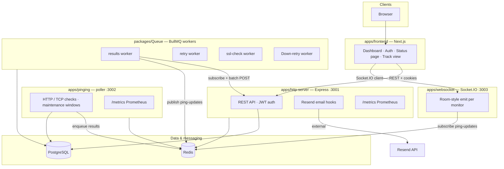
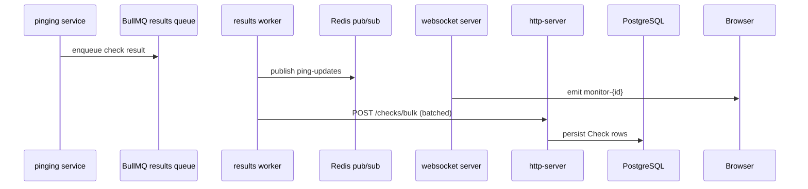

# My Timer — Uptime & downtime monitoring

A **monorepo** that powers an uptime monitoring product: users add HTTP or TCP port checks, get **real-time dashboards**, **public status pages**, **email alerts** (downtime, recovery, SSL expiry), and **rich incident diagnostics** when something fails.

Built with [Turborepo](https://turborepo.dev/), [pnpm](https://pnpm.io/) workspaces, **PostgreSQL** (via Prisma), **Redis** (pub/sub + BullMQ), and a **Next.js** frontend.

---

## Architecture at a glance



### Request and check flow



When a check **fails**, the **retry** queue runs extra attempts; after repeated failure it can trigger **down alerts**, **incident records** (with diagnostics), and **periodic recovery** jobs until the service is back.

---

## Repository layout

| Path | Role |
|------|------|
| `apps/frontend` | Next.js UI: `/auth`, `/dashboard`, `/statusPage/...`, `/track/...` |
| `apps/http-server` | Express API, JWT, monitors CRUD, bulk checks, incidents, email endpoints, public `/status/:slug` |
| `apps/pinging` | Scheduled polling of active monitors (HTTP + TCP port), pushes results to BullMQ |
| `apps/websocket` | Socket.IO server; forwards Redis `ping-updates` to connected clients |
| `packages/DB` | Prisma schema + client (`User`, `Monitor`, `Check`, `Incident`) |
| `packages/Queue` | BullMQ queues/workers: result batching, retries, SSL cron, recovery loop |
| `packages/ui`, `packages/eslint-config`, `packages/typescript-config` | Shared UI and tooling |

---

## Features

- **Accounts** — Sign up / sign in; JWT stored in cookies; dashboard is protected client-side.
- **Monitors** — Per URL: type **HTTP** or **PORT**, interval (e.g. 30s–10m), optional title, **pause/resume**, **maintenance windows** (failures during the window are treated as OK for alerting).
- **Public status page** — Shareable page by monitor **slug** (`/statusPage/...`); shows uptime stats, daily rollup, recent checks and incidents (data from `GET /status/:slug`).
- **Detail / track view** — Per-monitor charts and logs (`/track/[monitorId]`); can subscribe to **live latency** via WebSocket (`NEXT_PUBLIC_WS_URL`).
- **Alerting** — Email via **Resend**: downtime, recovery, and **SSL expiring soon** (daily SSL job).
- **Incidents** — On sustained failure, diagnostics may include DNS, ping, SSL info, traceroute hops, and coarse **geo** for the last responsive hop (via external IP lookup).
- **Observability** — Prometheus-compatible metrics on the HTTP API and pinging service (`/metrics`).

---

## Data model (summary)

- **User** — id, name, email, password (plain in current API — tighten for production).
- **Monitor** — url, type (`HTTP` \| `PORT`), port, interval, status, `slug`, maintenance fields, `active`, optional `sslExpiryDays`, relations to checks.
- **Check** — outcome per probe: HTTP status or synthetic codes, latency, `ok`, timestamp; optional **Incident** with diagnostic fields.

---

## Ports and services (local defaults)

| Service | Port | Notes |
|---------|------|--------|
| Frontend (Next.js) | `3000` | `pnpm --filter frontend dev` |
| http-server | `3001` | Main REST API |
| pinging | `3002` | Poller + metrics |
| websocket | `3003` | Socket.IO (CORS defaults to `http://localhost:3000`) |
| Redis | `6379` | Queues + pub/sub |
| PostgreSQL | *env* | `DATABASE_URL` for Prisma |

Frontend reads `NEXT_PUBLIC_BACKEND_URL` and `NEXT_PUBLIC_WS_URL` (see `apps/frontend/src/lib/constants.ts`); defaults match the ports above.

---

## Prerequisites

- Node.js **≥ 18**
- **pnpm** 9 (`packageManager` in root `package.json`)
- **PostgreSQL** and **Redis** running and reachable

---

## Setup

1. **Install dependencies** (from repo root):

   ```sh
   pnpm install
   ```

2. **Database** — Set `DATABASE_URL` in `packages/DB` (or root) for Prisma, then:

   ```sh
   pnpm run db:generate
   pnpm run db:deploy
   ```

3. **Environment variables** — Typical values:

   - `DATABASE_URL` — PostgreSQL connection string  
   - `JWT_SECRET` — signing key for API tokens  
   - `REDIS_HOST` / `REDIS_PORT` — Redis for ioredis and BullMQ  
   - `BACKEND_URL` — Base URL of http-server (used by workers calling `/checks/bulk`, `/send/email`, etc.)  
   - `Resend_API` — Resend API key for transactional email  
   - Frontend: `NEXT_PUBLIC_BACKEND_URL`, `NEXT_PUBLIC_WS_URL` when not using localhost defaults  

4. **Run everything in dev** — From root:

   ```sh
   pnpm dev
   ```

   Or run individual apps with filters, e.g. `pnpm --filter frontend dev`, `pnpm --filter http-server dev`, `pnpm --filter pinging dev`, `pnpm --filter websocket dev`, and `pnpm --filter @repo/queue run worker`.

---

## Docker

A multi-service stack is defined in `docker/docker-compose.yml`: **redis**, **http-server** (built from `docker/Dockerfile.backend`), **worker** (`docker/Dockerfile.Queue.yml`), **pinging**, and **websocket**. Provide `DATABASE_URL` and `BACKEND_URL` in the environment used by Compose.

---

## CI

`.github/workflows/cd.yml` builds and pushes Docker images for multiple services on pushes to `main`. Ensure Dockerfile paths and image tags match your registry naming (local Compose uses `Dockerfile.backend` and `Dockerfile.Queue.yml` rather than a single naming scheme).

---

## Scripts (root)

| Script | Purpose |
|--------|---------|
| `pnpm dev` | Turborepo dev for all packages with a `dev` task |
| `pnpm build` | Production build |
| `pnpm lint` | Lint |
| `pnpm check-types` | Typecheck |
| `pnpm run db:generate` | Prisma client generate |
| `pnpm run db:deploy` | Prisma migrate deploy |

---

## License

Private project (`private: true` in `package.json`). Adjust as needed.
